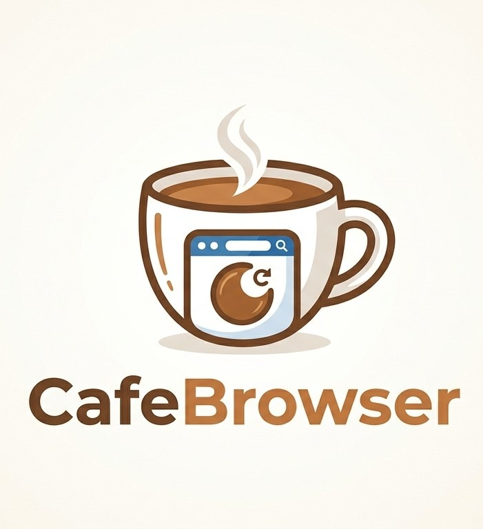

<div align="center">



# ☕ Coffee Browser

**Navegador web desktop minimalista com foco em privacidade, no estilo Brave — feito com Electron.**


</div>
</div>

## ✨ Funcionalidades

| | |
|---|---|
| 🛡️ **Coador (AdBlock nativo)** | Bloqueio de anúncios e rastreadores em nível de rede, com whitelist por site, pausa global e seletor de elementos |
| 🔐 **Login real (Google/OAuth)** | User-Agent consistente com o Chromium embarcado — sign-in do Google, Microsoft, Discord e outros funciona de verdade |
| 🌐 **DoH Cloudflare** | DNS-over-HTTPS seguro (1.1.1.1) para todas as requisições |
| 🖥️ **Terminal integrado** | Emulador de terminal embutido (`cafe://terminal`) |
| 🌙 **Modo escuro forçado** | Tema escuro aplicado por padrão em todos os sites |
| ⬇️ **Gerenciador de downloads** | Progresso em tempo real, pausar/resumir/cancelar/refazer e histórico persistente |
| 📺 **Compartilhamento de tela** | Captura de tela/janela com seletor visual nativo |
| 🧩 **Multi-abas reais** | Cada aba é uma instância Chromium completa via `<webview>` |
| 🌍 **Multi-idioma** | Internacionalização dinâmica da interface |
| 🔖 **Favoritos & Histórico** | Barra de favoritos, histórico completo e busca omnibox inteligente |
| 🪟 **Janela frameless customizada** | Controles de janela próprios, 100% integrados ao design system |

## ⌨️ Atalhos de teclado

| Atalho | Ação |
|---|---|
| `F5` / `Ctrl+R` | Recarregar página |
| `F12` | Abrir/fechar DevTools (console) da aba ativa |
| `Ctrl+T` | Nova aba |
| `Ctrl+W` | Fechar aba atual |
| `Ctrl+L` / `Ctrl+K` | Focar omnibox |
| `Ctrl+Shift+N` | Nova aba privada |
| `Ctrl+H` | Histórico |
| `Ctrl+B` | Alternar barra de favoritos |
| `Ctrl+,` | Configurações |
| `Ctrl+0` / `Ctrl++` / `Ctrl+-` | Zoom 100% / aumentar / diminuir |
| Mouse 4 / Mouse 5 | Voltar / Avançar |
| `Ctrl+Scroll` | Zoom na página |

## 🚀 Instalação

### Instalador (recomendado)

Baixe o **`CoffeeBrowser-Setup.exe`** mais recente e execute. O instalador autônomo permite escolher:

- 📂 Pasta de instalação
- ☕ Nível de torra do perfil
- 🛡️ Ativar Coador (adblock)
- 🖥️ / 📌 Atalhos na área de trabalho e menu iniciar
- 🚀 Iniciar junto ao Windows
- 🌐 Definir como navegador padrão

### Rodar do código-fonte

```bash
git clone https://github.com/Thiago142007/Coffee-Browser.git
cd Coffe-Browser/Browser
npm install
npm start
```

### Linux

Build multiplataforma (funciona a partir do Windows, Linux ou macOS):

```bash
cd Browser
npm run build:linux        # x64
npm run build:linux-arm64  # ARM64 (Raspberry Pi 5+, etc.)
```

O pacote é gerado em `Browser/dist/CoffeeBrowser-linux-x64/`. Para executar:

```bash
cd dist/CoffeeBrowser-linux-x64
chmod +x CoffeeBrowser
./CoffeeBrowser
```

Para integrar ao menu do sistema, crie `~/.local/share/applications/coffee-browser.desktop`:

```ini
[Desktop Entry]
Name=Coffee Browser
Exec=/caminho/para/CoffeeBrowser-linux-x64/CoffeeBrowser
Icon=/caminho/para/logo.png
Type=Application
Categories=Network;WebBrowser;
StartupWMClass=CoffeeBrowser
```

> **Nota:** o instalador gráfico (`CoffeeBrowser-Setup.exe`) é exclusivo do Windows. No Linux o navegador roda como pacote portátil. O áudio de sistema no compartilhamento de tela (`loopback`) é um recurso exclusivo do Windows; no Linux compartilhe com microfone.

## 🔨 Build

```bash
# Empacotar o navegador (executável portátil)
cd Browser
npm run build:exe

# Gerar payload + instalador autônomo
cd ../Installer
Compress-Archive -Path "..\Browser\dist\CoffeeBrowser-win32-x64\*" -DestinationPath "payload.zip" -Force
csc /nologo /target:winexe /out:CoffeeBrowser-Setup.exe /win32icon:assets\logo.ico `
    /resource:payload.zip StandaloneSetup.cs `
    /r:System.dll /r:System.Core.dll /r:System.Drawing.dll `
    /r:System.Windows.Forms.dll /r:System.IO.Compression.dll `
    /r:System.IO.Compression.FileSystem.dll
```

## 📁 Estrutura do projeto

```
Coffe-Browser/
├── Browser/                 # Aplicação principal (Electron)
│   ├── main.js              # Processo principal: janelas, adblock, downloads, OAuth, permissões
│   ├── preload.js           # Bridge IPC segura
│   ├── index.html           # Shell da interface
│   ├── js/                  # Abas, omnibox, escudos, downloads, i18n, terminal...
│   ├── css/                 # Design system Coffee
│   └── assets/              # Logos e preview
└── Installer/               # Instalador autônomo (WinForms) + payload
```

## 🛠️ Tecnologias

- [Electron](https://www.electronjs.org/) (Chromium 150)
- JavaScript / HTML5 / CSS3 puros — sem frameworks
- PowerShell para extração e registro de atalhos no Windows
- C# WinForms para o instalador standalone

---

<div align="center">

Feito com ☕ e muito café — **Coffee Browser Team**

</div>
